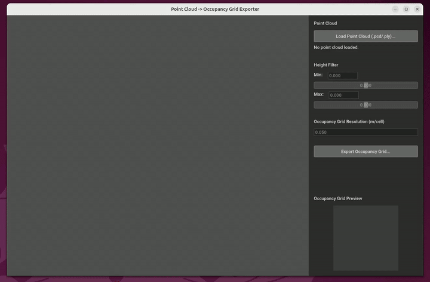
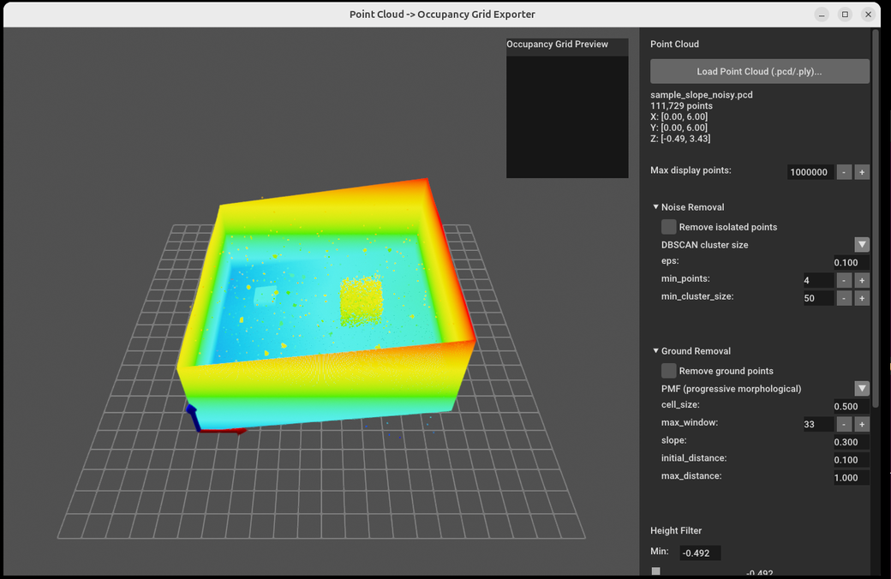
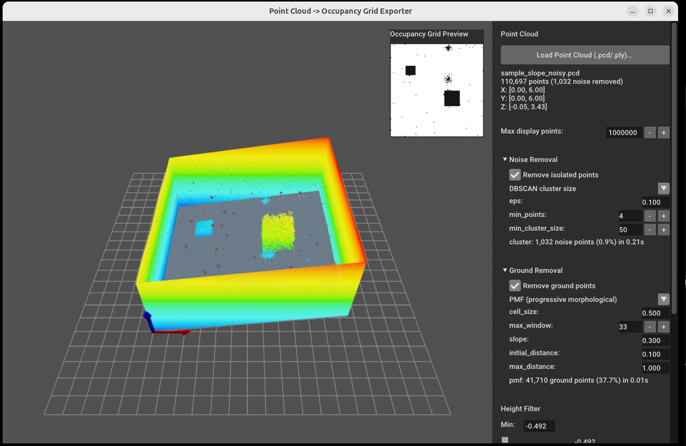
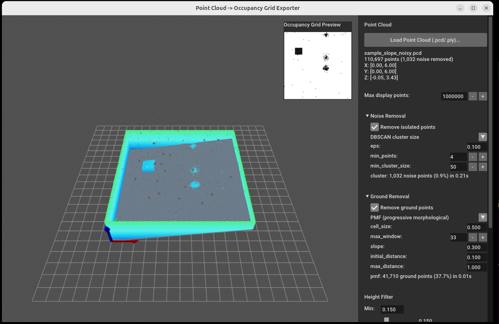

# Point Cloud -> Occupancy Grid Exporter

[](https://github.com/atinfinity/pointcloud-map-gui/actions/workflows/ci.yml)

A tool that loads a 3D point cloud (PCD/PLY), lets you visualize it and adjust the
height range and resolution in an Open3D GUI, and exports a ROS 2
(`map_server` / `nav2_map_server`) compatible occupancy grid map (PGM + YAML).
It does not depend on ROS 2 itself and runs as a standalone Python application.



## Documentation

| Document | What it covers |
|---|---|
| [Algorithms](docs/algorithms.md) | What noise removal, ground removal and the occupancy grid actually do, and which method to pick |
| [Display thinning](docs/display.md) | How the 3D view stays responsive on multi-million-point clouds |
| [Sample data](docs/sample-data.md) | The bundled clouds and what each one is for |
| [Command-line tools](docs/cli.md) | The comparison, benchmark and sample-generation tools, and their options |
| [TUNING.md](docs/TUNING.md) | Symptom -> method -> parameter, backed by measurements |

## Layout

```
src/pointcloud_map_gui/     the application and its modules
    tools/                  command-line tools, run with python -m
docs/                       the documents above, plus images
sample_data/                generated sample clouds (.pcd/.ply)
tests/                      headless tests of the GUI-independent logic
```

## Setup

### Requirements

- **[uv](https://docs.astral.sh/uv/) must be installed first.** It is what
  manages the dependencies and the Python version; there is no `pip install`
  path. See [the install instructions](https://docs.astral.sh/uv/getting-started/installation/),
  or on Linux and macOS:

  ```bash
  curl -LsSf https://astral.sh/uv/install.sh | sh
  ```

- **Python 3.10, 3.11 or 3.12.** Not 3.13 or newer: Open3D 0.19.0 is its latest
  release and publishes wheels only up to CPython 3.12, with no sdist to build
  from, so newer versions cannot install it. You do not have to install a
  matching Python yourself -- uv reads the pinned version from
  `.python-version` and downloads it, so this works even when your system
  Python is newer.

### Install

```bash
uv sync
```

## Run

```bash
uv run pointcloud-map-gui
```

The window needs an X server. On WSL that is WSLg, which works, but it also
advertises a Wayland compositor that Open3D's GLFW prefers and cannot draw on
-- there the command used to hang with no window. The app now selects X11 for
itself when it sees WSL and `XDG_SESSION_TYPE` is unset, so nothing is needed
from you; if you set that variable yourself, your choice is kept. Elsewhere,
if no window appears, check that `echo $DISPLAY` is not empty.

## Usage

1. Click "Load Point Cloud (.pcd/.ply)..." and select a point cloud file.
2. The point cloud is displayed in the 3D view, with point count and XYZ
   bounds shown in the panel. Clouds larger than "Max display points" are
   thinned for drawing only (see [Display thinning](docs/display.md)); the
   panel then also reports how many points are being shown.

   

   The height filter starts at the cloud's full Z range, so every scanned
   cell is `occupied` and the preview is solid black until you narrow it or
   remove the ground.

3. (Optional) Enable "Remove isolated points" under Noise Removal to drop
   stray points before anything else happens (see
   [Noise removal](docs/algorithms.md#noise-removal)). Removed points are shown in faded red
   and are excluded from the map entirely -- they do not count as scanned
   cells and do not enlarge the map bounds.
4. (Optional) Enable "Remove ground points" under Ground Removal to detect
   the floor even when it slopes or undulates, and pick a method from the
   dropdown (see [Ground removal](docs/algorithms.md#ground-removal)). Detected ground points
   are tinted a faded blue in the 3D view -- still there, still counted as
   scanned ground, but never `occupied` in the map. They are the only points
   drawn de-emphasised, so that tint always means "classified as ground"
   rather than "outside the height filter".

   

   Here 1,032 points were dropped as noise (the faded red specks) and 41,710
   classified as ground (the blue floor). The preview now separates `free`
   from `occupied`.

5. Adjust the height range with the Height Filter's Min/Max sliders (or the
   number fields): points within the range are colored by a height-based
   colormap (blue = low, red = high), and points outside the range are
   hidden, so nothing you have excluded hides what you have kept.
6. Set the output resolution with Occupancy Grid Resolution (m/cell). A live
   preview of the resulting occupancy grid is overlaid on the top-right of
   the 3D view.

   

   With the range narrowed to 0.15-1.50 m the walls above it are gone from
   the view, leaving only what the map is actually built from.

   (Optional) Set "Map Cleanup: min occupied blob (cells)" to 2-4 to erase
   specks: 8-connected groups of `occupied` cells smaller than that are
   turned `free`. 0 or 1 disables it. This catches leftovers no point-level
   filter can (clumps touching a wall, ground-removal misses), but also
   erases real obstacles that small -- keep it just above the speck size.
7. Click "Export Occupancy Grid..." and choose a destination base name to
   write `<name>.pgm` and `<name>.yaml`.

Processing order: noise removal -> ground removal -> height filter ->
occupancy grid -> map cleanup.

Not sure which method or parameter to change? See [TUNING.md](docs/TUNING.md)
for symptom -> method -> parameter guidance backed by measurements on the
sample data.

## Tests

The GUI-independent core logic (`pointcloud_map_gui/occupancy_grid.py`, `pointcloud_map_gui/map_writer.py`,
`pointcloud_map_gui/colorize.py`, `pointcloud_map_gui/ground_grid.py`, `pointcloud_map_gui/ground_removal.py`, `pointcloud_map_gui/noise_removal.py`,
`pointcloud_map_gui/map_preview.py`) can be run headless with
pytest.

```bash
uv run pytest tests/ -v
```

## Supported formats

- Input: `.pcd`, `.ply` (whatever `Open3D`'s `read_point_cloud` supports)
- Output: `.pgm` (binary P5) + `.yaml` (ROS 2 map_server / nav2 compatible)

## License

Licensed under the [Apache License, Version 2.0](LICENSE).
